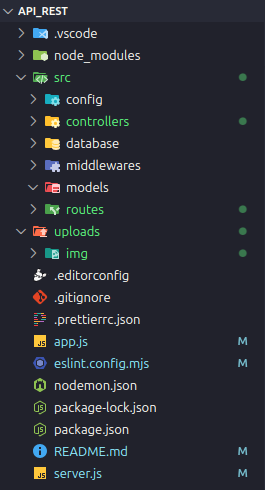
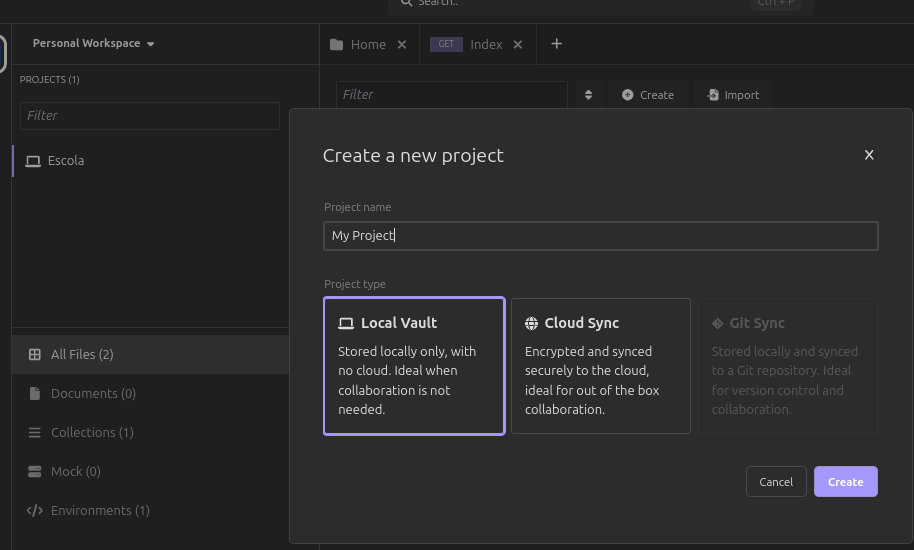
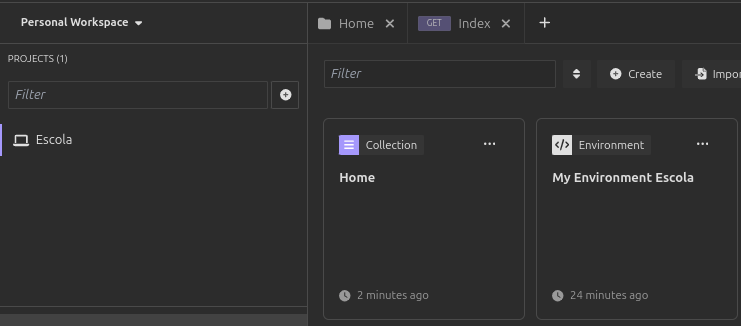
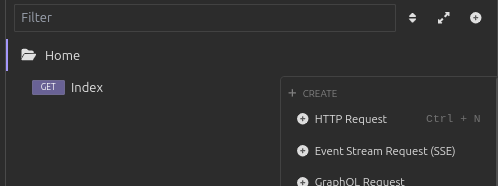
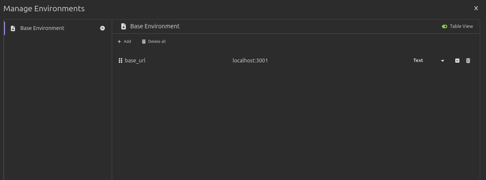

# Instalando na pasta do projeto

### Iniciando

`npm init -y`

Wrote to .../projects/API_REST/package.json:

```bash
{
  "name": "api_rest",
  "version": "1.0.0",
  "main": "index.js",
  "scripts": {
    "test": "echo \"Error: no test specified\" && exit 1"
  },
  "keywords": [],
  "author": "",
  "license": "ISC",
  "description": ""
}

```

### Configurando o ESLINT

`npx eslint --init`

You can also run this command directly using 'npm init @eslint/config@latest'.

> api_rest@1.0.0 npx
> create-config

@eslint/create-config: v1.10.0

- What do you want to lint? · `javascript`
- How would you like to use ESLint? · `problems`
- What type of modules does your project use? · `esm`
- Which framework does your project use? · `none`
- Does your project use TypeScript? · `No` / Yes
- Where does your code run? · `node`

The config that you've selected requires the following dependencies:

eslint, @eslint/js, globals

- Would you like to install them now? · No / `Yes`
- Which package manager do you want to use? · `npm`
  ☕️Installing...

added 87 packages, and audited 88 packages in 6s

24 packages are looking for funding
run `npm fund` for details

found 0 vulnerabilities
Successfully created /home/leandro/Documentos/projects/API_REST/eslint.config.mjs file.

#### Instalando as devDependences

`npm i nodemon sucrase --save-dev`

#### Instalando o express 4.21 compatível com as configurações do projeto

`npm install express@4.21.0`

## Dividindo as pastas da aplicação (Boas Práticas)

## Criando o projeto no Insomnia

### Criando um novo projeto

Divisão


Clicar no mais e criar o projeto



### Criar uma nova coleção

No caso a primeiro foi a Home


### Criar um HTTP Request

Criar uma requisição, no caso o GET


## Configurando o Base Environment

Configurando o Base


## Configuração do Sequelize

Ver alterações no commit referente a configuração do Sequelize

- Instalado o sequelize-cli:
  `npm sequelize-cli --save-dev`
- Cria um arquivo de Migração de alunos:
  `npx sequelize-cli migration:create --name=alunos`
- Cria a tabela do banco de dados de acordo com as instruções pre-programadas no Migration:
  `npx sequelize-cli db:migrate`
- Cria um arquivo de Migração de users:
  `npx sequelize-cli migration:create --name=users`
- Cria a tabela do banco de dados de acordo com as instruções pre-programadas no Migration:
  `npx sequelize-cli db:migrate`
- Se errou, precisar apagar e refazer, passos:

  `npx sequelize-cli db:migrate:undo`

  > - para desfazer a última

  **ou**

  `npx sequelize-cli db:migrate:undo --to 20250820184449-alunos.js`

  > - para desfazer todas até a migração citada

* faz edição:
  `npx sequelize-cli db:migrate`

## Instalando o Bcryptjs

- `npm i bcryptjs`

### Fazendo o addHook

🏀 Explicando com Basquete:

- Imagine um marcador de basquete que vai ser orientado pelo seu técnico para ficar atento entre o passe do armador e aquele pivô top. O marcador vai ficar atento no caminho interceptando todas as ações.

"gancho" | INTERCEPTAÇÃO : entre um pedido e uma execução, beforeSave seria o caminho do passe, executar a ação descrita:

```
this.addHook('beforeSave', async user => {
      user.password_hash = await bcrypt.hash(user.password, 8);
    });

```

## CRUD de usuários

- Create -> User.create(req.body);
- Reade -> User.findAll() | User.findByPk(req.params.id);
- Update -> User.update(req.body);
- Delete -> User.destroy();

## Instalando JsonWebToken

`npm i jsonwebtoken`

- Usando

```
import jwt from 'jsonwebtoken';

const { id } = user;
    const token = jwt.sign({ id, email }, process.env.TOKEN_SECRET, {
      expiresIn: process.env.TOKEN_EXPIRATION,
    });
    return res.json({ token });
```

## Dicas finais e revisão

### Controller

Geralmente cada Controller vai ter aproximadamente 5 métodos.

#### Padrão de mercado

- index -> lista todos os usuários (GET)
- store/create -> cria um novo usuário (POST)
- delete -> apaga um usuário (DELETE)
- show -> mostra um usuário (GET)
- update -> atualiza um usuário (PATCH: só um valor | PUT: todos os campos)

Se tiver mais do que isso, provavelmente está atribuindo mais ações que
esse Controller precisa, talz seja melhor criar um novo Controller
Específico para ação e local desejado!
